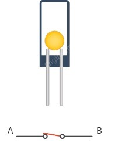
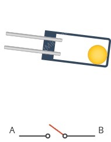
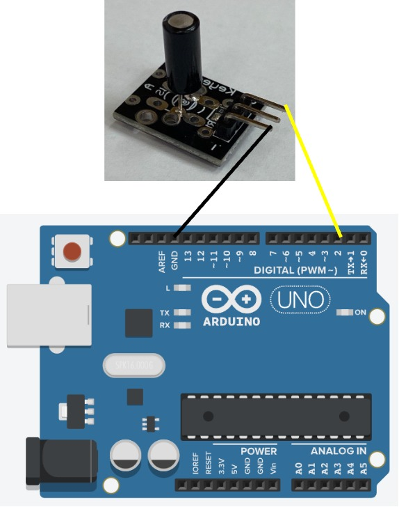

# Sensore maniglia

## Componenti:
- Board ELEGOO UNO R3
- breadboard
- sensore inclinazione:
  - tilt ball switch
  - resistenza 10k Ohm

## Descrizione:
codice usato per attivare un sensore "tilt ball switch" che dovrà essere **installata nella maniglia della porta principale (d'ingresso) della Smart Home**. Questo permetterà di identificare quando qualcuno proverà ad aprire la porta.

 

## Circuito

